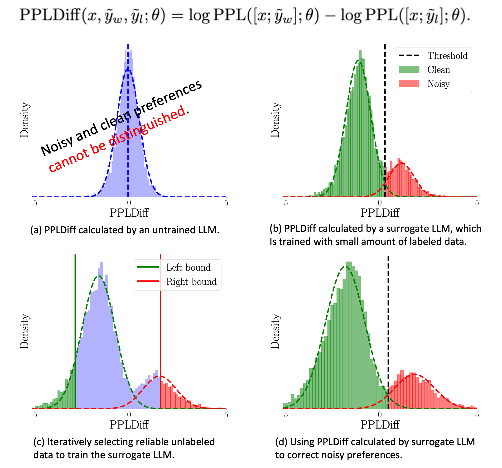

# Perplexity-aware Correction for Robust Alignment with Noisy Preferences

This is the source code for the NeurIPS 2024 paper "Perplexity-aware Correction for Robust Alignment with Noisy Preferences", Keyi Kong*(SDU), Xilie Xu* (NUS), Di Wang (KAUST), Jingfeng Zhang (University of Auckland/RIKEN-AIP), Mohan Kankanhalli (NUS).

## Let's align LLMs via PerpCorrect

**PerpCorrect corrects noisy preferences using PPLDiff, which is calculated through an iteratively trained surrogate LLM.**

  

### Python Environment

This code mainly uses Huggingface's [trl](https://github.com/huggingface/trl) library. You can use the following script to configure the environment.

~~~bash
pip install -r requirements.txt
~~~

### Preprocessing and SFT

~~~bash
# preprocess preferences dataset first
python src/preprocessing.py
# supervised fine-tune
bash bash/sft.sh
~~~

### PerpCorrect and Robust Alignment

For DPO series experiments, you can use following script.

~~~bash
bash bash/dpo.sh
~~~

For PPO series experiments, you can use following script.

~~~bash
bash bash/ppo.sh
~~~

If you need rDPO experiments, you need to modify the trl library as follows:

~~~bash
if self.loss_type == "sigmoid":
    # cDPO
    if self.label_smoothing >= 0:
        losses = (
            - F.logsigmoid(self.beta * logits) * (1 - self.label_smoothing)
            - F.logsigmoid(-self.beta * logits) * self.label_smoothing
        )
    # rDPO
    else :
        losses = (
            - F.logsigmoid(self.beta * logits) * (1 + self.label_smoothing)
            - F.logsigmoid(-self.beta * logits) * self.label_smoothing
        ) / (1 + 2 * self.label_smoothing)
~~~

## Acknowledgement

The project is built upon [trl](https://github.com/huggingface/trl) .

## BibTeX

~~~bibtex
@inproceedings{
    kong2024perplexityaware,
    title={Perplexity-aware Correction for Robust Alignment with Noisy Preferences},
    author={Keyi Kong and Xilie Xu and Di Wang and Jingfeng Zhang and Mohan Kankanhalli},
    booktitle={The Thirty-eighth Annual Conference on Neural Information Processing Systems},
    year={2024},
    url={https://openreview.net/forum?id=OUXnnPJzXJ}
}
~~~

## Contact

Please drop an e-mail to <luxinyayaya@mail.sdu.edu.cn> if you have any enquiry.
